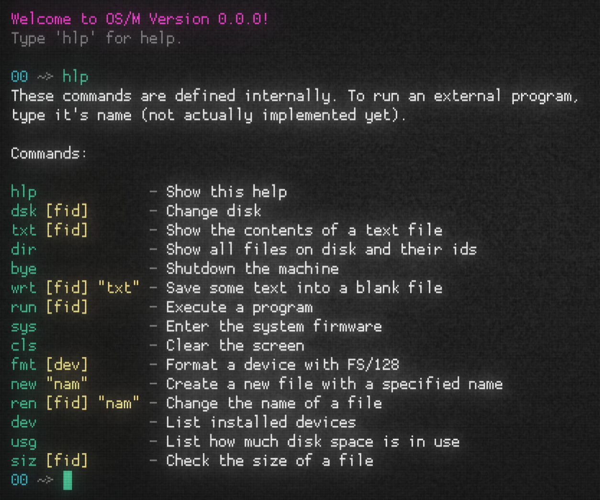

# OS/Micro

An experimental disk operating system for the [Ozpex
Micro](https://github.com/beauconstrictor/ozpex-micro), taking
heavy inspiration from CP/M.



The operating system is built in 3 layers:

1. The bootloader, which is very minimal as it has to fit into just
   256 bytes.
2. The libraries, which implement the filesystem, I/O and interacting
   with external devices.
3. The shell, which allows the user to run simple commands which wrap
   library functions and load programs from disk.

# Getting Started

To boot OS/M, you will first need to
install the latest release of the [Ozpex Micro
emulator](https://github.com/beauconstrictor/ozpex-micro).  This is
the fantasy computer that OS/M runs under. Then, download the latest
release of OS/M from this repo. You can then boot the operating
system like this (assuming you have `osm.bin` in your directory):

```sh
ozm -m bdsk:osm.bin@0
```

This distribution image also includes two programs: a hex monitor
and a basic pong game (which uses vim keybinds for movement). The
hex monitor uses quite an archaic syntax which is explained in the
[source file](src/monitor.asm).

You can easily write your own programs for OS/M
that statically link with the OS's libraries. Using
[`vasm`](http://www.compilers.de/vasm.html), you can compile this
hello world program:

```asm
  .include "mmap.asm"

  .org RUN_LOAD

start:
  ld   hl,message call print ret

message:
  .asciiz "Hello, world!\n"

  .include "io.asm"
```

...like this, as long as you have copied the needed libraries
(`mmap.asm` and `io.asm`) from the the latest release into your
directory:

```
sh vasmz80_oldstyle -dotdir -Fbin -esc hello.asm -o hello
```


Then, you just have to create a disk image with your program on it.
This repository includes a [utility](src/fs128-tool.py) just for
that (you need Python to run the tool):

```
python3 fs128-tool.py hello -o mydisk.bin
```

Once you have a disk image, you just need to boot into OS/M and
run your program!

```
$ ozm -m bdsk:osm.bin@0 -m disk:mydisk.bin@1
00 ~> dsk 01
01 ~> dir
06# hello
01 ~> run 06
Hello, world!
01 ~>
```

That's all it takes to develop for OS/M! If you want to write more
complex programs, it make help to take a look at the source of some
of the OS libraries, as I am told they are quite readable - some
familiarity with Z80 assembly with help of course.

## Shell

OS/Micro's shell uses 3 letter commands, followed by any number of
arguments. If you want to read a file, use the `txt` command. If
you want to run a file, you use the, well, `run` command.

However, you can't pass filenames to these commands directly (at
least not yet).  Instead, you use the `dir` command to list all
your files on the current disk, along with their *FIDs*. These are
unique two digit hex numbers that represent a file on disk. It is
the FID that you pass to commands (always include the leading zero!).

If you are curious how the filesystem works, read the FS/128
[spec](https://github.com/BeauConstrictor/OS-128/blob/main/filesystem.md).
Note that OS/M's `fs.asm` library does not yet implement the full
filesystem spec. In particular, only 16 files are supported on disk,
as opposed to the theoretical maximum of 64.

## License

This project is licensed under the GNU GPL-2.0
